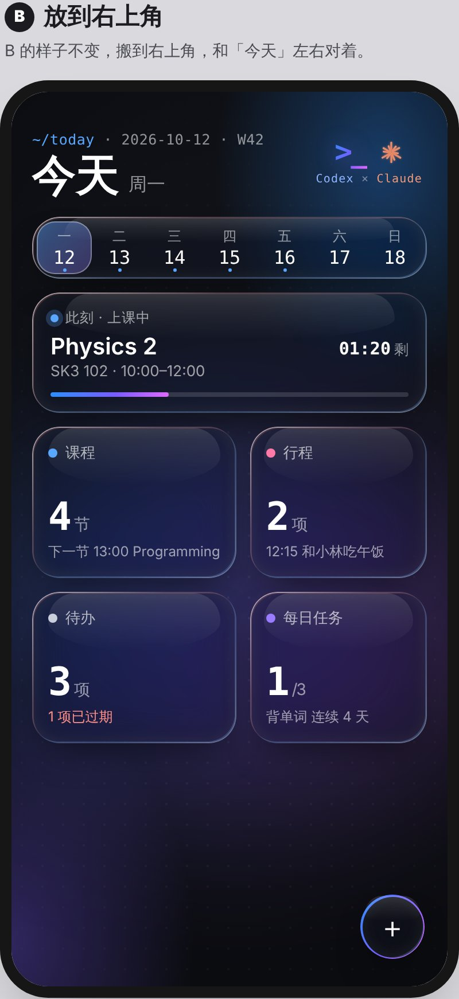
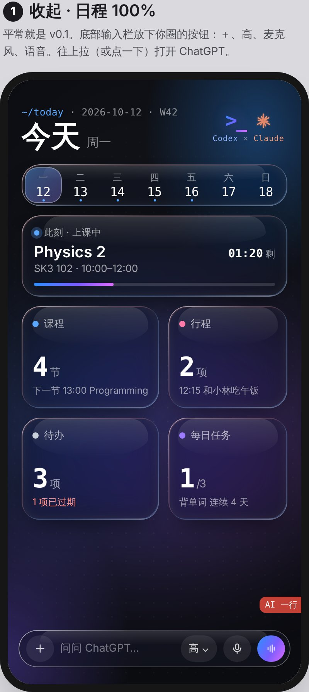
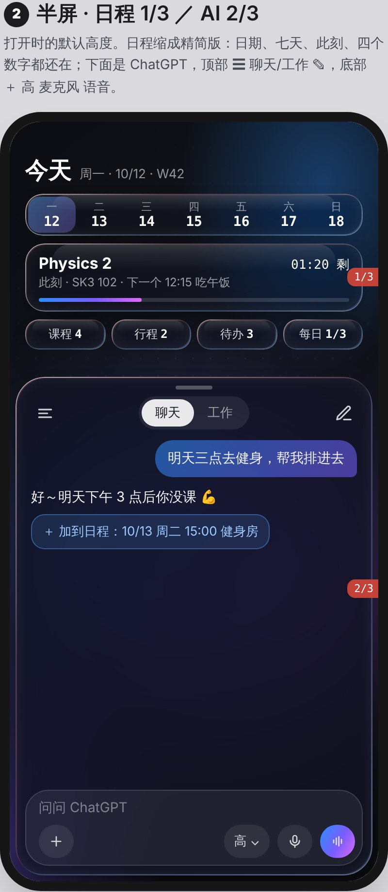
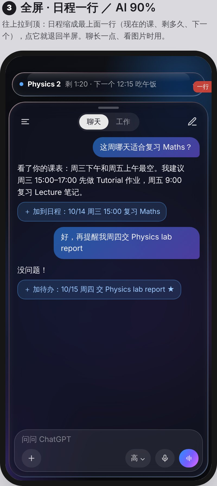
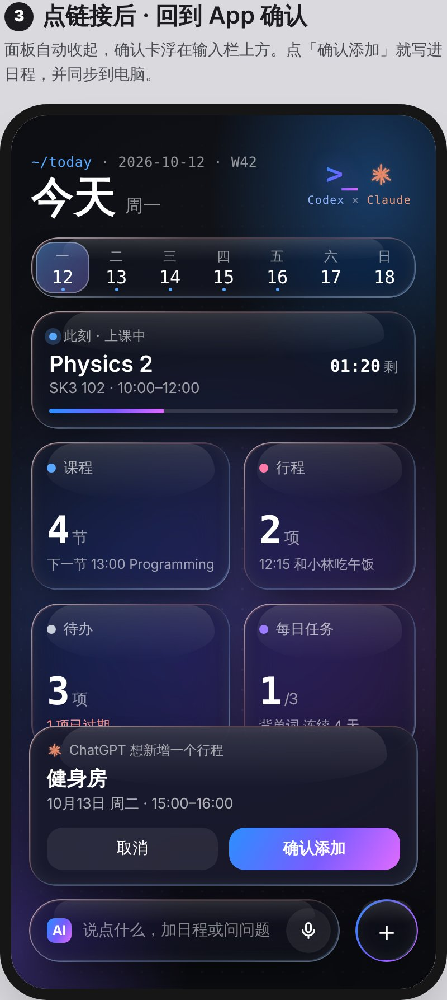
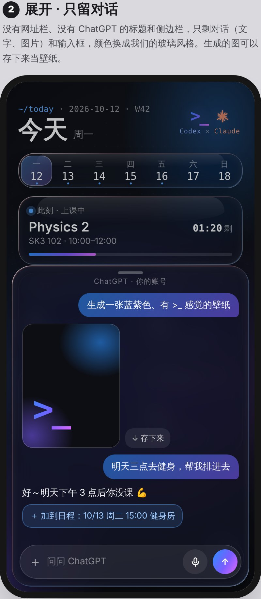

# 设计 v0.1（定稿）

手机和电脑都能用的「课表 · 每日任务 · 行程 · 待办」，以现有课表网站为基础。以后打包成 APK。

| 首页 | AI 收起 | AI 半屏 | AI 全屏 | 确认卡 | 只留对话 |
|---|---|---|---|---|---|
|  |  |  |  |  |  |

`mockup.html` 是画这些图的原稿（浏览器打开就能看）。

## 外观

- **配色：蓝紫。** 深炭黑底（约 `#0b0c10`–`#15171e`）加很淡的点阵，右上和左下各一团蓝 / 紫柔光。
  重点色是蓝 `#2b8fff` 到紫 `#7a5cff` 再到粉紫 `#e06bff` 的渐变，用在选中的日子、进度条、发送键。
- **毛玻璃卡片：** 半透明深色（约 `rgba(22,24,34,.38)`），模糊 16px，边缘一圈细亮边，带一点点彩色折射，上半部有淡淡的光泽。
- **字：** 标题和正文用系统字体。日期、时间、数字用等宽字体（`SF Mono` / `JetBrains Mono` / `Menlo`），带一点写代码的感觉，例如 `~/today · 2026-10-12 · W42`。
- **右上角签名：** Codex 的 `>_`（蓝紫渐变）和 Claude 的光芒（陶土橘 `#d97757`）并排，下面一行小字 `Codex × Claude`。光芒是自己画的致敬图案，不是官方商标。

## 首页

- **每天一页，打开就停在今天。** 一周七天的条可以点、可以左右滑。
- **「此刻」卡：** 正在上的课、教室、剩多久、进度条。没课时不出现。
- **四张卡：** 课程、行程、待办、每日任务，各显示一个数字和一句话，例如「3 项 · 1 项已过期」。点进去看完整清单，新增也在里面。
- **没有浮动的「＋」按钮。** 只留 ChatGPT 输入栏里的 ＋，免得有两个 ＋。

## 底部 AI（ChatGPT）

- **输入栏**放 ChatGPT 自己的按钮：＋（附件）、思考强度（高）、麦克风、语音模式。
- **三个高度**（像地图 App 的底部面板，往上拉、往下拉）：
  1. **收起：** 只有输入栏，日程占满。
  2. **半屏（默认）：** 日程缩成精简版，占上面约 1/3，包括日期、七天、此刻、四个数字。ChatGPT 占下面约 2/3。
  3. **全屏：** 日程缩成最上面一行（现在的课 · 剩多久 · 下一个），点它退回半屏。
- **ChatGPT 面板只留对话：** 去掉网址栏、ChatGPT 的标题栏和侧边栏，换成我们的玻璃风格。
  保留：☰ 聊天记录、「聊天 / 工作」切换、✎ 新对话，以及对话里的文字和图片（生成的图可以存下来当壁纸）。
- **用的是 chatgpt.com 和自己的 Plus 账号**，所以有完整聊天记忆、可以选模型、可以生图。不用 API，也不用开电脑。
  - 只有 APK 能做到「只留对话」：App 里自己的内嵌网页，只改外观，不读取也不自动操作它的内容。
  - 网页版只能在新分页打开 chatgpt.com。
  - 内嵌网页不能用 Google 登录 ChatGPT，要用邮箱和密码。
  - ChatGPT 改版时，裁剪可能需要更新。

## 改日程：一律先确认

- ChatGPT 回答里的日程链接（例如 `＋ 加到日程：10/13 周二 15:00 健身房`），点一下就弹出确认卡。
  - 要在 ChatGPT 的「自定义指令」里写好链接格式，它才会这样回答。
- 在输入栏直接打日程类的话（「明天三点健身」「删掉周三的小组讨论」），由 App 自己听懂（手机本机的小模型或规则），一样先弹确认卡。
- 确认卡浮在输入栏上方，写明「ChatGPT 想新增一个行程 · 健身房 · 10月13日 周二 15:00–16:00」，有【取消】【确认添加】两个按钮。
- 确认后写进日程，经 Firebase 同步到其他设备。

## 不做的事

- **不模拟操作 ChatGPT 的界面**（自动打字、读取回答）：违反使用条款，会被封号，也很容易坏。
- **不用 OpenAI API。**
- **不用开发者模式连接器：** 开着时记忆会被关掉（多个第三方来源这样说）。

## 路线

| 版本 | 内容 |
|---|---|
| v0.1 | ✅ 外观和交互定稿（本文件） |
| v0.2 | 照 v0.1 改写网页（保留原课表的全部功能），接上 Firebase 同步 |
| v0.3 | 底部 AI 输入栏、确认卡、App 自己听懂日程类的话、ChatGPT 链接格式 |
| v0.4 | 用 Capacitor 打包 APK：只留对话的 ChatGPT 面板（三个高度）、通知、语音 |
